# Pixelate

> **SDXL + LoRA fine-tuning for anime pixel-art generation**

Pixelate adapts **Stable Diffusion XL 1.0** toward anime-style pixel art, with a particular focus on anime-girl imagery. The project fine-tunes only LoRA adapters attached to the SDXL U-Net while keeping the pretrained VAE, text encoders, and base U-Net weights frozen.

This README is both project documentation and a technical guide to the path from pixels → latents → diffusion → U-Net attention → LoRA adaptation → generated pixel art.

> **Repository-verified note:** the current `training.py` uses **LoRA rank 8**, not rank 32. The repository is treated as the implementation source of truth. The current repository also contains empty `inference/inference.py`, `inference/prompts.txt`, `preprocessing/prepare_dataset.py`, `preprocessing/download_dataset.py`, and `postprocessing/pixelate.py` files, so no unsupported inference/postprocessing commands or results are claimed here.

## Results

The repository currently does not contain generated-result assets or a completed inference implementation. Therefore this README deliberately does **not** fabricate sample images, benchmark scores, loss curves, or visual-quality claims.

When actual outputs are added, a controlled comparison should keep the **prompt, seed, inference steps, guidance scale, and resolution** fixed between base SDXL and SDXL + Pixelate LoRA.

---

## What Is Pixelate?

Pixelate is a small, reproducible experiment in **parameter-efficient diffusion fine-tuning**.

The base model is `stabilityai/stable-diffusion-xl-base-1.0`. Instead of retraining the entire SDXL network, Pixelate attaches low-rank adapters to selected U-Net attention projections and optimizes only those new parameters.

The project currently uses:

| Component | Project configuration |
|---|---|
| Base model | `stabilityai/stable-diffusion-xl-base-1.0` |
| VAE | `madebyollin/sdxl-vae-fp16-fix` |
| Dataset | `nullHawk/anime-pixel-art-2` |
| Selected images | 2,000 |
| Selection | standalone `1girl` tag |
| Caption change | only `1girl → girl` |
| Resolution | 256 × 256 |
| Batch size | 1 |
| Training steps | 20,000 |
| Learning rate | 1e-4 |
| LR scheduler | constant |
| Warmup | 100 steps |
| LoRA rank | **8** |
| LoRA alpha | **8** |
| LoRA initialization | Gaussian |
| LoRA targets | `to_k`, `to_q`, `to_v`, `to_out.0` |
| Optimizer | AdamW |
| Precision | FP16 mixed precision |
| Checkpoints | every 1,000 steps |
| Training environment | Kaggle |

The repository code freezes both CLIP text encoders, the VAE, and the pretrained U-Net, then adds LoRA adapters to the U-Net. citeturn3view0

---

## How Pixelate Works

At the highest level, Pixelate follows the normal latent-diffusion training loop:

```text
training image
      │
      ▼
   SDXL VAE
      │
      ▼
 clean latent x₀ ──────┐
      │                │
      │ + noise ε      │ random timestep t
      ▼                │
 noisy latent xₜ       │
      │                │
      └──────┬─────────┘
             ▼
       SDXL U-Net
             ▲
             │ text conditioning
       SDXL text encoders
             │
             ▼
       predicted noise
             │
             ▼
          MSE loss
             │
             ▼
      LoRA parameters
          updated
```

The important distinction is that **training and inference are different processes**. Training starts from real images and learns a noise-prediction objective. Inference starts from random noise and repeatedly denoises it into an image latent.

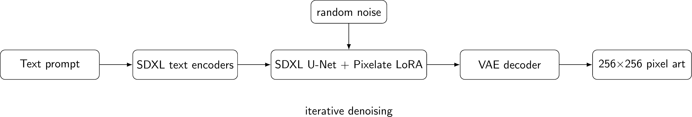

---

# Stable Diffusion XL

Stable Diffusion is a **latent diffusion** system: rather than performing the diffusion process directly in RGB pixel space, it operates in a learned latent representation. SDXL expands the architecture with a larger U-Net, additional attention capacity, and a second text encoder. citeturn5academia34

The conceptual pipeline is:

```text
TEXT SPACE
prompt
  │
  ▼
CLIP tokenizers + text encoders
  │
  ▼
text embeddings
  │
  └──────────────────────────────┐
                                 ▼
LATENT SPACE                conditional U-Net
random latent/noise ──────────────► denoising
                                 │
                                 ▼
                           denoised latent
                                 │
                                 ▼
IMAGE SPACE                   SDXL VAE
                                 │
                                 ▼
                              image
```

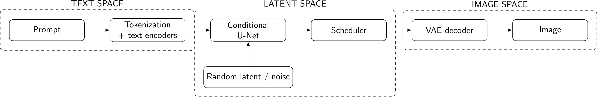

---

## From Pixels to Latents: The VAE

A **Variational Autoencoder (VAE)** provides the bridge between image space and latent space.

During Pixelate training, the RGB training image is encoded by the frozen SDXL VAE. The resulting latent is then scaled using the VAE's configured scaling factor before diffusion noise is added. citeturn3view0

Conceptually:

```text
256 × 256 × 3 RGB image
          │
          ▼
     VAE encoder
          │
          ▼
     latent representation
          │
       diffusion
          │
          ▼
     denoised latent
          │
          ▼
     VAE decoder
          │
          ▼
256 × 256 × 3 RGB image
```

For the usual SDXL VAE downsampling factor of 8, a 256 × 256 image corresponds to a **32 × 32 latent spatial grid**. The latent is not simply a resized image: its channels represent learned features rather than RGB colors.

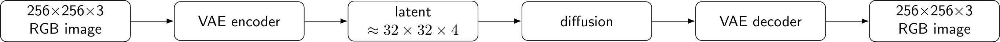

---

## Forward Diffusion

Training needs examples of what a partially corrupted latent looks like. Starting from a clean latent `x₀`, the scheduler adds Gaussian noise at a randomly selected timestep `t`.

A common formulation is:

\[
x_t = \sqrt{\bar\alpha_t}\,x_0 + \sqrt{1-\bar\alpha_t}\,\epsilon,
\qquad \epsilon \sim \mathcal N(0,I)
\]

The exact schedule is supplied by the SDXL scheduler configuration loaded by the training script; Pixelate samples a random timestep and calls `noise_scheduler.add_noise(...)`. citeturn3view0

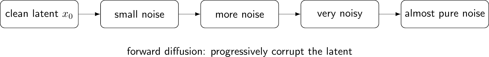

The purpose is not to make the image permanently noisy. It creates a supervised learning problem: **given a noisy latent, the model must predict the noise that was added.**

---

## Reverse Diffusion

Inference runs the process in the opposite direction.

```text
random latent noise
        │
        ▼
      U-Net
        │ predicted noise
        ▼
    scheduler
        │
        ▼
 less-noisy latent
        │
       repeat
        ▼
   clean latent
        │
        ▼
    VAE decoder
        │
        ▼
      image
```

The scheduler controls how each predicted-noise estimate is converted into the next latent. The U-Net is evaluated repeatedly at different timesteps.

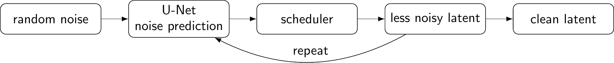

> The current repository does not provide a working inference implementation, so exact inference-step, guidance-scale, seed, and LoRA-loading defaults are intentionally left unspecified here.

---

# The SDXL U-Net

The U-Net is the main denoising network. A simplified conceptual view has three regions:

1. **Downsampling path** — progressively processes latent features at lower spatial resolutions.
2. **Middle block** — processes deeply transformed features.
3. **Upsampling path** — reconstructs spatial detail while receiving skip connections from the downsampling path.

Attention blocks provide a mechanism for relating feature locations and conditioning information.

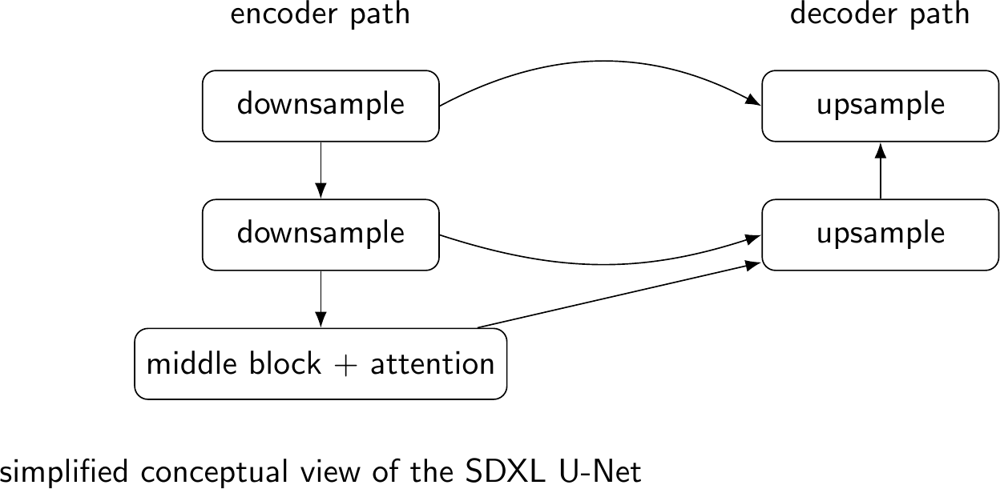

This is a **conceptual diagram**, not a claim that the figure reproduces every internal SDXL block or tensor shape.

---

# Attention

Attention lets one representation decide which other representations are useful.

Given an input representation `X`, learned projections produce:

```text
X ── WQ ──► Q   Query:   what am I looking for?
X ── WK ──► K   Key:     what information do I represent?
X ── WV ──► V   Value:   what information do I provide?
```

The canonical scaled dot-product attention equation is:

\[
\operatorname{Attention}(Q,K,V)
=
\operatorname{softmax}\left(\frac{QK^T}{\sqrt{d_k}}\right)V
\]

The operations have a simple interpretation:

1. `QKᵀ` measures compatibility between queries and keys.
2. Dividing by `√dₖ` stabilizes the scale of the dot products.
3. `softmax` converts scores into normalized attention weights.
4. Multiplying by `V` gathers information according to those weights.

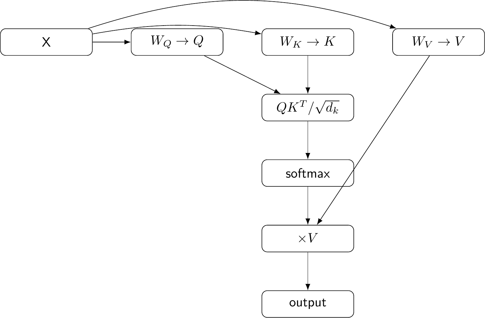

---

# Cross-Attention in SDXL

Cross-attention is particularly important for text-to-image diffusion because the two sides of the interaction are different.

In the conceptual SDXL U-Net attention path:

```text
image / latent features ──► Q

text embeddings ──────────► K
                     └────► V

             QKᵀ
              │
              ▼
           softmax
              │
              ▼
            × V
              │
              ▼
      conditioned latent features
```

This is **not ordinary self-attention**. In self-attention, Q, K, and V are derived from the same sequence or representation. In cross-attention, the U-Net-side representation supplies queries while the text representation supplies keys and values.

That gives the denoising network a way to use the prompt while predicting how the noisy latent should be transformed.

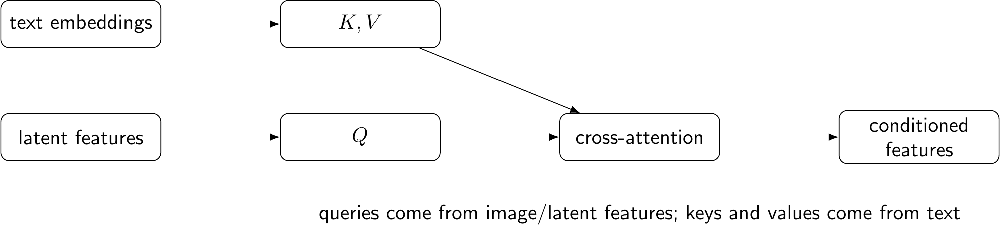

SDXL specifically uses two text encoders, and the Pixelate training code concatenates their penultimate hidden states to form the prompt embeddings. It also passes pooled text embeddings as additional conditioning. citeturn3view0turn5search5

---

# LoRA

## Why LoRA?

Full fine-tuning would update a very large pretrained model. LoRA instead freezes the original weights and learns a small low-rank update. This reduces the number of trainable parameters and produces lightweight adapter weights. citeturn5academia33turn5search0

Start with a normal linear layer:

\[
y = Wx
\]

LoRA keeps `W` frozen and learns an update:

\[
\Delta W = BA
\]

so the effective weight becomes:

\[
W' = W + \frac{\alpha}{r}BA
\]

where:

| Symbol | Meaning |
|---|---|
| `W` | frozen pretrained weight matrix |
| `A` | trainable low-rank matrix |
| `B` | trainable low-rank matrix |
| `r` | LoRA rank |
| `α` | LoRA scaling factor |

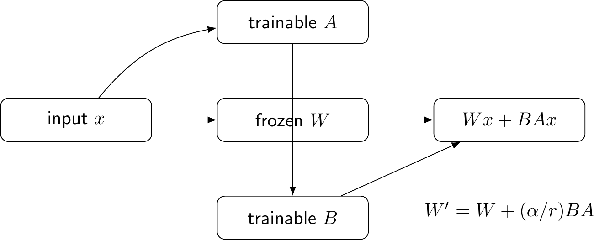

LoRA is useful here because Pixelate is trying to move a general-purpose image generator toward a narrower visual distribution without replacing the whole pretrained model.

---

# Where Pixelate Adds LoRA

This is one of the places where the implementation matters more than a generic LoRA tutorial.

Pixelate creates:

```python
LoraConfig(
    r=8,
    lora_alpha=8,
    init_lora_weights="gaussian",
    target_modules=[
        "to_k",
        "to_q",
        "to_v",
        "to_out.0",
    ],
)
```

The adapter is then attached to the **U-Net**. The text encoders, VAE, and original U-Net parameters are frozen. citeturn3view0

The four target names correspond to the learned projections around attention blocks:

```text
SDXL U-Net attention block

        ┌───────────────┐
        │   attention   │
        └───────┬───────┘
                │
       ┌────────┼────────┐
       ▼        ▼        ▼
     to_q     to_k     to_v
       │        │        │
       └────────┼────────┘
                ▼
             attention
                │
             to_out.0
                │
                ▼
          conditioned features

     LoRA adapters are attached to
     these target projections.
```

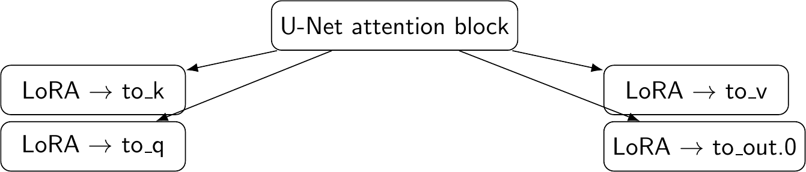

The current code therefore adapts **attention projections in the U-Net**, not the entire SDXL model. Hugging Face's Diffusers LoRA documentation describes the same general `LoraConfig` pattern for U-Net attention projections. citeturn5search0

---

# Pixelate Training

The actual training loop is compact:

```text
training image
      │
      ▼
 frozen VAE encoder
      │
      ▼
 clean latent x₀
      │
      ├─────────────── random Gaussian noise ε
      │
      └─────────────── random timestep t
              │
              ▼
        noisy latent xₜ
              │
              ▼
      frozen text encoders ───► text conditioning
              │                       │
              └──────────┬────────────┘
                         ▼
                 U-Net + LoRA
                         │
                         ▼
                predicted noise
                         │
                         ▼
                    MSE loss
                         │
                         ▼
                 backpropagation
                         │
                         ▼
                 LoRA parameters
                    are updated
```

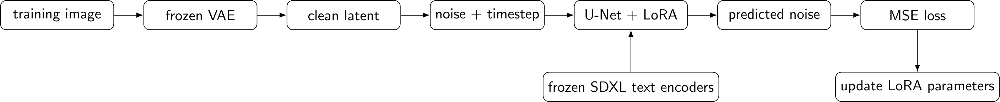

The code encodes images with the frozen VAE, encodes captions with two frozen CLIP text encoders, samples Gaussian noise and random timesteps, calls the scheduler to construct noisy latents, predicts the noise with the U-Net, and minimizes mean-squared error. citeturn3view0

---

# Training Mathematics

Let:

- `x₀` = clean latent
- `ε` = sampled Gaussian noise
- `t` = randomly sampled diffusion timestep
- `xₜ` = noisy latent
- `c` = text conditioning

The U-Net predicts:

\[
\epsilon_\theta(x_t,t,c)
\]

Pixelate uses the noise itself as the target and computes:

\[
\mathcal L
=
\left\|\epsilon-\epsilon_\theta(x_t,t,c)\right\|_2^2
\]

In code, this is the direct MSE calculation:

```python
target = noise
loss = F.mse_loss(
    model_pred.float(),
    target.float(),
    reduction="mean",
)
```

The optimizer then updates the parameters that remain trainable — the LoRA adapter parameters. citeturn3view0

This is the central learning signal of Pixelate: the adapter learns to alter the U-Net's noise prediction so that the denoising trajectory becomes better aligned with the fine-tuning distribution.

---

# Dataset

Pixelate selects examples from:

`nullHawk/anime-pixel-art-2`

The selection script loads the training split in streaming mode and stops after 2,000 selected images. An example is accepted only when the tag list contains the standalone tag `1girl`. The script then changes **only** that exact tag to `girl`; every other tag is retained. Captions are stored in `metadata.jsonl`, and images are saved under `images/`. citeturn3view3

```text
source dataset
     │
     ▼
stream training split
     │
     ▼
standalone "1girl" present?
     │
   yes
     │
     ▼
replace only "1girl" → "girl"
     │
     ▼
write PNG + metadata.jsonl
     │
     ▼
stop at 2,000 images
```

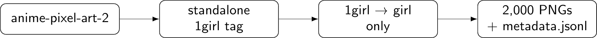

The resulting training directory expected by `training.py` is:

```text
data/anime-pixel-art-2k/
├── images/
└── metadata.jsonl
```

The training dataset class reads the metadata file, opens each image as RGB, scales pixel values into `[-1, 1]`, and tokenizes the stored caption with both SDXL tokenizers. citeturn3view0

---

# Why 256 × 256?

Pixelate deliberately trains at **256 × 256**. The repository configuration sets `RESOLUTION = 256`, uses batch size 1, and supplies that resolution to the SDXL conditioning time IDs. citeturn3view0

This is a practical fine-tuning choice rather than a claim that SDXL fundamentally requires or only supports that resolution. SDXL was developed for higher-resolution text-to-image generation, while Pixelate uses a smaller training resolution to make a focused experiment more manageable on the stated Kaggle environment. citeturn5academia34

At the VAE level, 256 × 256 corresponds to approximately 32 × 32 latent spatial positions for the usual factor-8 SDXL VAE.

---

# Memory and Training Configuration

Pixelate uses the following memory-conscious choices that are actually present in the repository:

- **LoRA instead of full U-Net fine-tuning**
- **batch size 1**
- **FP16 mixed precision**
- frozen VAE and text encoders
- frozen base U-Net weights
- LoRA-only optimizer parameters

The repository does **not** currently show gradient checkpointing or 8-bit AdamW configuration, so those are not listed as project features. citeturn3view0

The optimizer is AdamW with:

```text
learning rate = 1e-4
betas         = (0.9, 0.999)
weight decay  = 1e-2
eps           = 1e-8
scheduler     = constant
warmup        = 100 steps
```

Checkpoints are saved every 1,000 training steps, and the final LoRA weights are saved to `outputs/pixelate-lora`. citeturn3view0

---

# Inference

The intended inference architecture is straightforward:

```text
prompt
  │
  ▼
SDXL text encoders
  │
  ▼
text embeddings
  │
  ├──────────────────────┐
  ▼                      ▼
random latent         U-Net + LoRA
                            │
                            ▼
                         scheduler
                            │
                            ▼
                     repeated denoising
                            │
                            ▼
                      denoised latent
                            │
                            ▼
                       VAE decoder
                            │
                            ▼
                         256×256 image
```

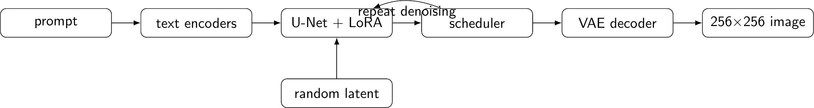

However, the current repository's `inference/inference.py` and `inference/prompts.txt` are empty files. Consequently, this README does **not** invent exact inference arguments, prompts, seeds, guidance scale, number of steps, or LoRA loading code. citeturn4view0turn4view1

For reference only, Diffusers provides SDXL LoRA loading APIs such as `load_lora_weights`, but those generic APIs should not be presented as Pixelate's implemented inference path until the repository contains that code. citeturn5search1turn5search2

---

# Base SDXL vs Pixelate LoRA

A useful qualitative experiment is:

```text
same prompt
same seed
same inference steps
same guidance scale
same resolution
        │
        ├──────────────► base SDXL
        │
        └──────────────► SDXL + Pixelate LoRA
```

The purpose is to hold the generation procedure constant and isolate the visual effect of the learned adapter.

A seed matters because diffusion generation begins from a random latent. Reusing the same seed makes the initial random state reproducible, making the comparison more controlled.

This should be described as a **qualitative controlled comparison**, not as a formal benchmark, unless quantitative evaluation is later added.

The current repository does not contain the completed inference implementation or generated comparison assets, so no visual superiority claim is made here.

---

# Results and Evaluation

At the current repository state, the following have **not** been established by repository evidence:

- FID
- CLIP score
- accuracy
- benchmark ranking
- training-time measurements
- GPU-utilization measurements
- parameter-count report
- formal human evaluation
- reproducible generated-image gallery

That absence matters. A fine-tuning configuration is not the same thing as a demonstrated performance result.

When results are added, the most useful first evaluation would be a fixed-seed base-vs-LoRA image grid plus several prompts that probe:

- anime-face structure
- pixel-art edge structure
- palette behavior
- prompt adherence
- robustness to different character descriptions

Those should be reported as qualitative observations unless a quantitative evaluation protocol is implemented.

---

# Limitations

The current repository supports several clear limitations and unknowns:

1. **Small fine-tuning subset.** The training set is limited to 2,000 selected examples. citeturn3view3
2. **Low training resolution.** The experiment uses 256 × 256 inputs. citeturn3view0
3. **Narrow selection rule.** The subset is selected using the standalone `1girl` tag, so the resulting distribution is not a general pixel-art dataset. citeturn3view3
4. **No formal benchmark.** The repository currently provides no FID, CLIP, or other quantitative evaluation.
5. **Inference is unfinished in the repository.** The inference script and prompt file are empty at the current revision. citeturn4view0turn4view1
6. **Postprocessing is unfinished in the repository.** The postprocessing script is present but currently empty. citeturn4view3
7. **Some preprocessing helpers are empty.** `download_dataset.py` and `prepare_dataset.py` are present, while the verified subset-selection logic lives in `select_subset.py`. citeturn4view4turn4view2turn3view3

These limitations define what Pixelate currently demonstrates: a concrete SDXL U-Net LoRA training implementation and dataset-selection pipeline, rather than a completed, benchmarked image-generation system.

---

# Repository Structure

The current repository tree is:

```text
pixelate/
├── inference/
│   ├── inference.py
│   └── prompts.txt
├── notebooks/
│   ├── inference.ipynb
│   └── training.ipynb
├── postprocessing/
│   └── pixelate.py
├── preprocessing/
│   ├── download_dataset.py
│   ├── prepare_dataset.py
│   └── select_subset.py
├── .gitignore
├── README.md
├── requirements.txt
└── training.py
```

The repository itself lists these directories and files. citeturn1view0turn2view0turn2view1turn2view2turn2view3

### Important files

| Path | Role |
|---|---|
| `training.py` | Main SDXL + LoRA training implementation |
| `preprocessing/select_subset.py` | Selects 2,000 `1girl` examples and writes metadata |
| `inference/inference.py` | Intended inference entrypoint; currently empty |
| `inference/prompts.txt` | Intended prompt collection; currently empty |
| `postprocessing/pixelate.py` | Intended postprocessing entrypoint; currently empty |
| `notebooks/training.ipynb` | Training notebook |
| `notebooks/inference.ipynb` | Inference notebook |
| `requirements.txt` | Python dependencies |

The dependency file currently lists PyTorch, torchvision, Transformers, Diffusers, Accelerate, PEFT, Datasets, Safetensors, Pillow, and Hugging Face Hub. citeturn3view6

---

# Reproduction

## 1. Clone the repository

```bash
git clone https://github.com/AirBwender/pixelate.git
cd pixelate
```

## 2. Install dependencies

The repository provides a `requirements.txt` containing the required ML libraries:

```bash
pip install -r requirements.txt
```

## 3. Prepare the dataset

The verified subset-selection script expects the Hugging Face dataset `nullHawk/anime-pixel-art-2` and creates:

```text
data/anime-pixel-art-2k/
├── images/
└── metadata.jsonl
```

Run:

```bash
python preprocessing/select_subset.py
```

The script streams the training split, selects standalone `1girl` examples, changes only `1girl` to `girl`, and stops after 2,000 images. citeturn3view3

> The repository's `download_dataset.py` and `prepare_dataset.py` are currently empty, so no additional command is claimed for those files.

## 4. Train

The training script is directly executable as a Python entrypoint:

```bash
python training.py
```

The script sets the seed to 42, constructs the frozen SDXL components, adds rank-8 LoRA adapters to the U-Net, and trains for up to 20,000 steps. citeturn3view0

## 5. Check outputs

The configured output directory is:

```text
outputs/pixelate-lora/
```

Intermediate checkpoints are written as:

```text
outputs/pixelate-lora/checkpoint-1000/
outputs/pixelate-lora/checkpoint-2000/
...
```

with the final adapter saved to the output directory. citeturn3view0

## 6. Inference

Inference should be treated as **not yet reproducible from the current repository** because the committed inference implementation is empty. Once an implementation is added, its exact command, prompt format, seed, scheduler settings, inference steps, guidance scale, and LoRA loading path should be documented here rather than inferred from generic Diffusers examples.

---

# Training Configuration

| Hyperparameter | Value |
|---|---:|
| `RESOLUTION` | 256 |
| `BATCH_SIZE` | 1 |
| `MAX_TRAIN_STEPS` | 20,000 |
| `LEARNING_RATE` | 1e-4 |
| `LR_SCHEDULER` | constant |
| `LR_WARMUP_STEPS` | 100 |
| `LORA_RANK` | 8 |
| `lora_alpha` | 8 |
| `init_lora_weights` | gaussian |
| `CHECKPOINTING_STEPS` | 1,000 |
| `MIXED_PRECISION` | fp16 |
| AdamW betas | (0.9, 0.999) |
| AdamW weight decay | 1e-2 |
| AdamW epsilon | 1e-8 |
| DataLoader workers | 2 |
| DataLoader | shuffled, pinned memory |

These values are taken from the current `training.py`, not from the original project brief. citeturn3view0

---

# The Central Story

Pixelate can be understood as one continuous technical chain:

```text
PIXELATE
   │
   ▼
DATA
   │
   ▼
LATENT REPRESENTATION
   │
   ▼
DIFFUSION
   │
   ▼
U-NET
   │
   ▼
ATTENTION
   │
   ▼
TEXT CONDITIONING
   │
   ▼
LoRA
   │
   ▼
TRAINING
   │
   ▼
INFERENCE
   │
   ▼
PIXEL ART
```

<<<<<<< HEAD
The key idea is not that Pixelate creates a new image generator from scratch. It starts with a pretrained latent diffusion model and learns a **targeted modification of its U-Net attention projections** using a focused anime pixel-art dataset.
=======
The key idea is not that Pixelate creates a new image generator from scratch. It starts with a pretrained latent diffusion model and learns a **small, targeted modification of its U-Net attention projections** using a focused anime pixel-art dataset.

---

# References
>>>>>>> 5868b5f (Add technical README and documentation figures)

## Project

- **Pixelate repository:** AirBwender/pixelate
- **Dataset:** `nullHawk/anime-pixel-art-2`

## Technical

- **SDXL — Improving Latent Diffusion Models for High-Resolution Image Synthesis** — Podell et al., 2023.
- **LoRA — Low-Rank Adaptation of Large Language Models** — Hu et al., 2021.
- **Hugging Face Diffusers — Stable Diffusion XL documentation.**
- **Hugging Face Diffusers — LoRA training and loading documentation.**

<<<<<<< HEAD
=======
## Educational

- Luis Serrano Academy — generative models, VAEs, diffusion, denoising, Stable Diffusion, and transformer fundamentals.
- Transformer/attention educational material for the intuition behind Q/K/V and scaled dot-product attention.

The external references above are used to explain the underlying concepts; the Pixelate repository remains the authority for Pixelate-specific implementation details.

---

## Reproducibility Checklist

- [x] Repository inspected
- [x] Project-specific hyperparameters verified against `training.py`
- [x] Dataset selection logic verified against `select_subset.py`
- [x] Training and inference separated
- [x] Frozen and trainable components identified
- [x] LoRA targets verified
- [x] Rank discrepancy corrected: **8 in code, not 32**
- [x] No fabricated results
- [x] No fabricated benchmark metrics
- [x] Empty repository components explicitly identified
- [x] Conceptual diagrams labeled as conceptual where appropriate
- [x] Training objective connected to the implementation

---

>>>>>>> 5868b5f (Add technical README and documentation figures)
*Pixelate is currently best understood as a focused SDXL U-Net LoRA fine-tuning experiment whose next major documentation milestone is a completed, reproducible inference path and an evidence-backed results gallery.*
